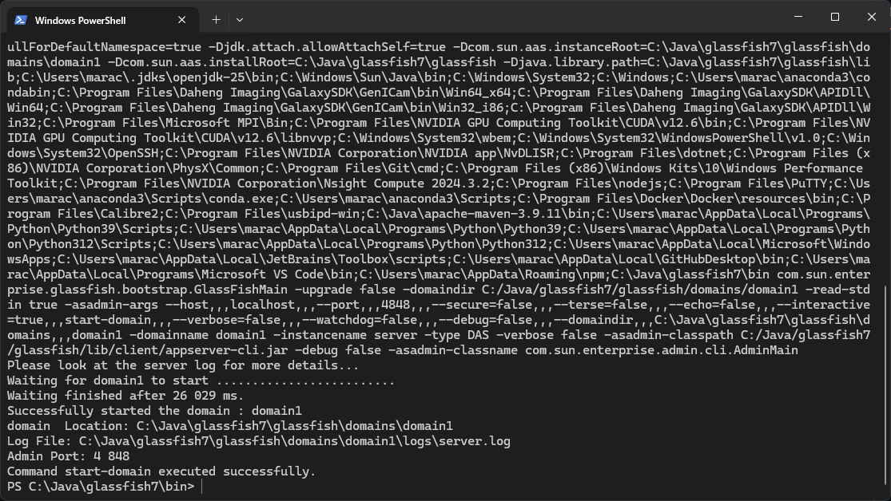
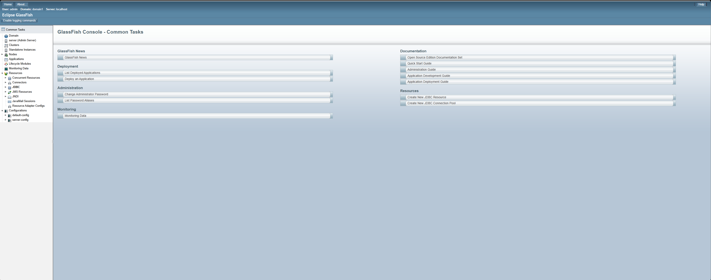
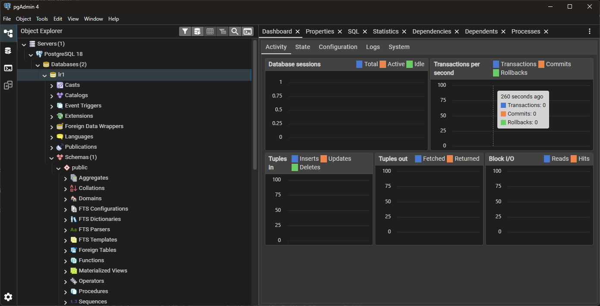
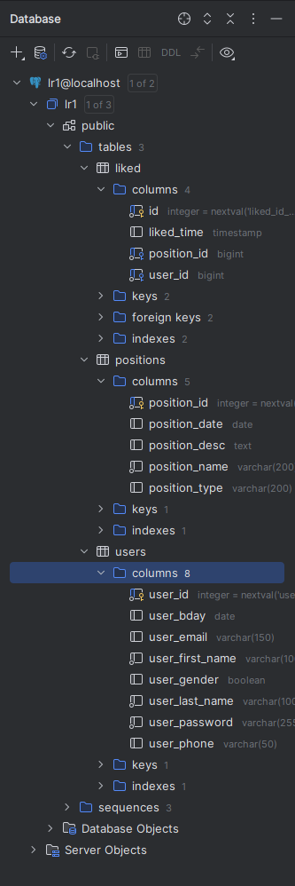
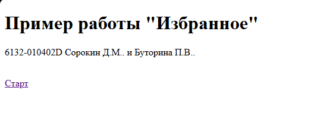
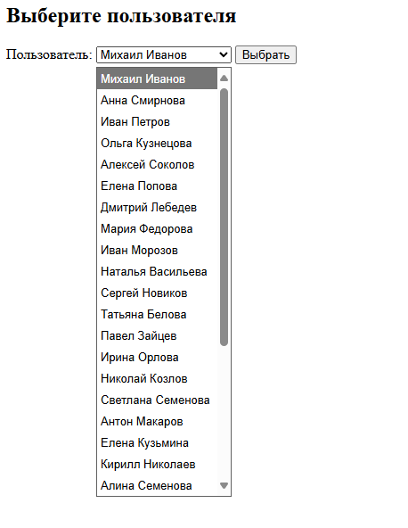
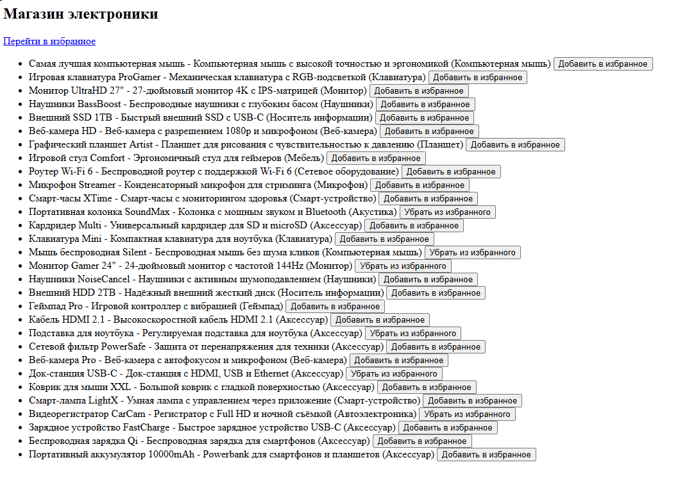
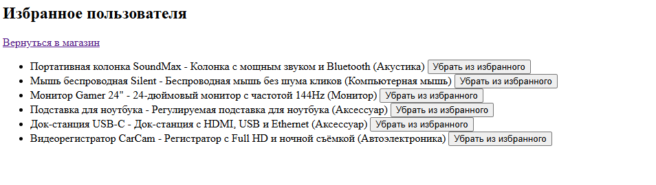

# Практическая работа №1
## Приложение с типовой архитектурой JakartaEE
*Выполнили студенты группы 6132-010402D Сорокин Д.М. и Буторина П.В.*


### Задание 1
Запуск сервера приложений GlassFish осуществляется с помощью команды:
```
[путь к glassfish]\bin\asadmin start-domain
``` 


На скриншоте представлена панель управления сервером GlassFish:



### Задание 2
В качестве базы данных была выбрана **PostgreSQL**, **pgAdmin4** для доступа к базе данных, однако далее для доступа к бд использовалась только IDEA.



Доступ к бд с помощью встроенной фичи IDE:




### Задание 3

Скрипт для создания таблиц в базе данных:

```
CREATE TABLE users (
                       user_id SERIAL PRIMARY KEY,
                       user_password VARCHAR(255) NOT NULL,
                       user_first_name VARCHAR(100) NOT NULL,
                       user_last_name VARCHAR(100) NOT NULL,
                       user_gender BOOLEAN,
                       user_bday DATE,
                       user_email VARCHAR(150),
                       user_phone VARCHAR(50)
);

CREATE TABLE positions (
                           position_id SERIAL PRIMARY KEY,
                           position_name VARCHAR(200) NOT NULL,
                           position_desc TEXT,
                           position_type VARCHAR(200),
                           position_date DATE
);

CREATE TABLE liked (
                       id SERIAL PRIMARY KEY,
                       user_id INTEGER NOT NULL REFERENCES users(user_id),
                       position_id INTEGER NOT NULL REFERENCES positions(position_id),
                       liked_time TIMESTAMP DEFAULT CURRENT_TIMESTAMP,
                       CONSTRAINT unique_like UNIQUE (user_id, position_id)
);
```

### Задание 4

Классы users, positions и liked настроены как сущности с помощью аннотации @Entity. EntityManager используется для управления данными сущностями.

Подключение к базе данных организовано на уровне сервера приложений, в файле persistence.xml указан только настроенный JDBC Resource.

Все операции с данными реализованы в классах с подписью Repository.

### Задание 5

Бизнес логика реализована в классах c подписью Service, которые используют репозитории для доступа к данным БД.

### Задание 6

Для реализации пользовательского интерфейса использованы Java Servlets и JSP-страницы.

### Задание 7 
С помощью mvn clean install запускается приложение и создается war-файл, который загружается на сервер GlassFish в раздел Applications.

Далее представлены изображения, с примером работы программы:



Необходимо выбрать пользователя для запуска эмулятора магазина электроники:



После выбора можно добавить в избранное определенный товар:



Избранное пользователя:

