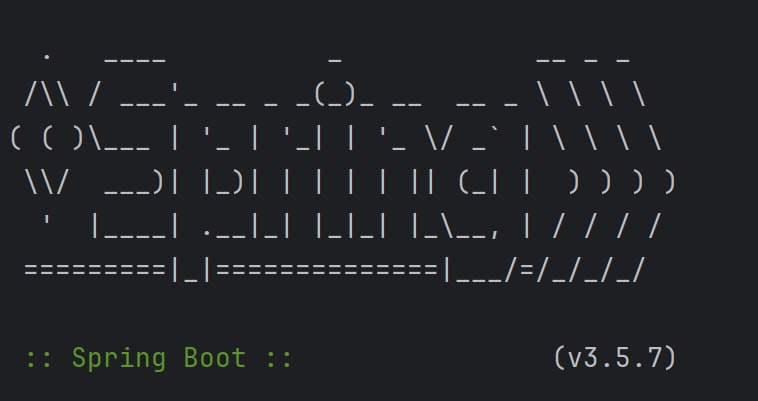
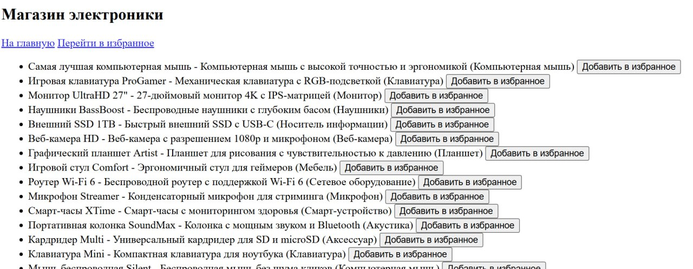
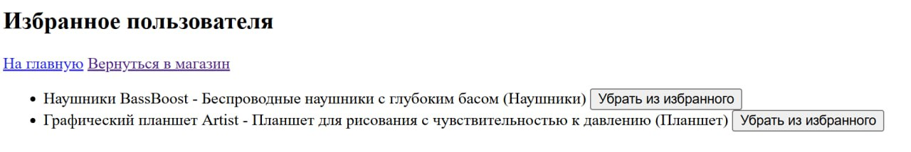

# Практическая работа №2
## Приложение на Spring
*Выполнили студенты группы 6132-010402D Сорокин Д.М. и Буторина П.В.*

### Задание 1
Было принято решение использовать сущности из 1 практического задания.

### Задание 2
Реализовали классы-репозитории для доступа к данным.

### Задание 3
Релизовали сервисы для обеспечения бизнес-логики приложения.

### Задание 4
Реализовали контроллеры и слои представления для полноценной работы приложения. 

### Задание 5
Работа не отличается от предыдущего практического задания. За исключением того, что сервер предоставляется библиотекой Spring boot.

