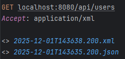
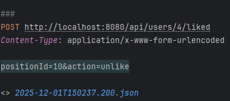
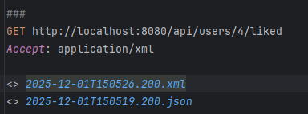
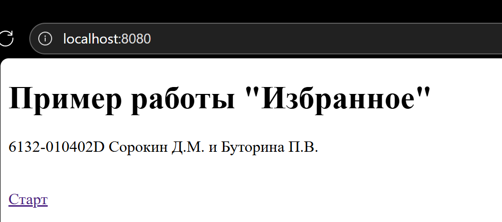
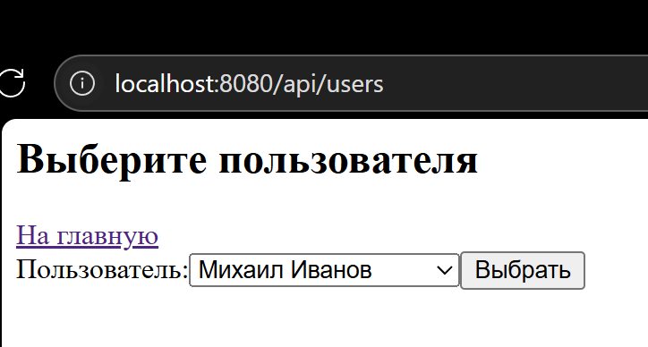
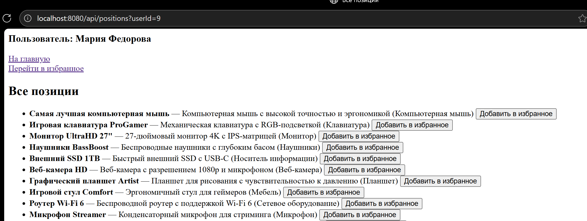
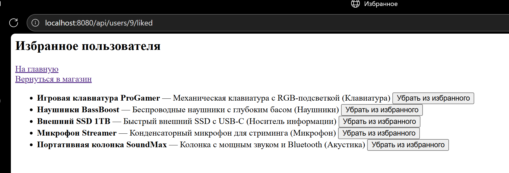

# Практическая работа №3
## RESTful веб-сервис
*Выполнили студенты группы 6132-010402D Сорокин Д.М. и Буторина П.В.*

### Задание 1
Мы решили реализовать с помощью Spring Rest потому что:
- Быстрое создание REST-сервисов
- Легкая интеграция с базой данных и безопасностью
- Удобная разработка микросервисов
- Мы уже работали с данным фреймворком

### Задание 2
Выбрали вторую практическую работу, однако пришлось изменить контроллеры для корректной работы приложения

### Задание 3
Реализовали REST контроллеры с поддержкой json и xml

### Задание 4
Разработали 3 XSL интерактивных представления с помощью которых приложение функционирует так же как и в предыдущих версиях

### Задание 5
Добавили тег в начало XML откликов

### Задание 6
Пример запросов с указанием типа возвращаемого ответа

Пример работы программы в браузере

