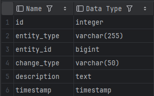
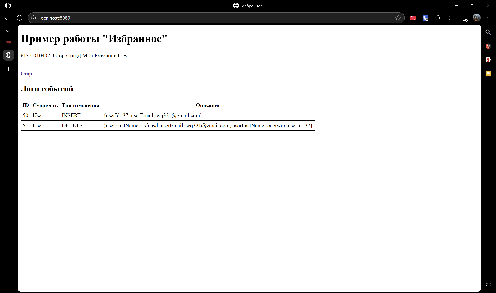
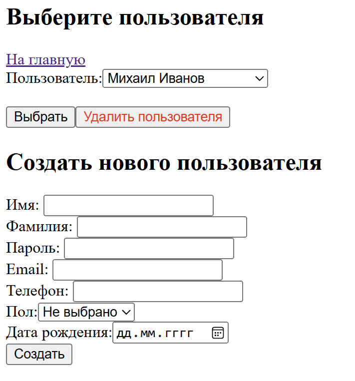
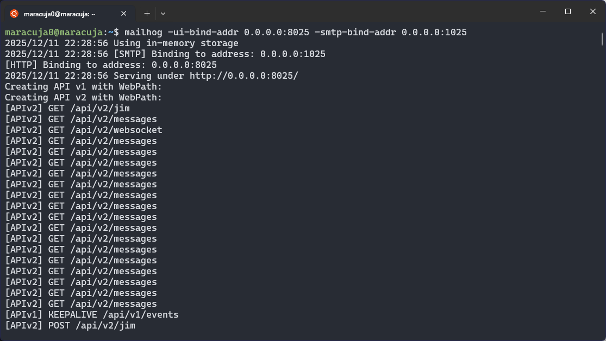
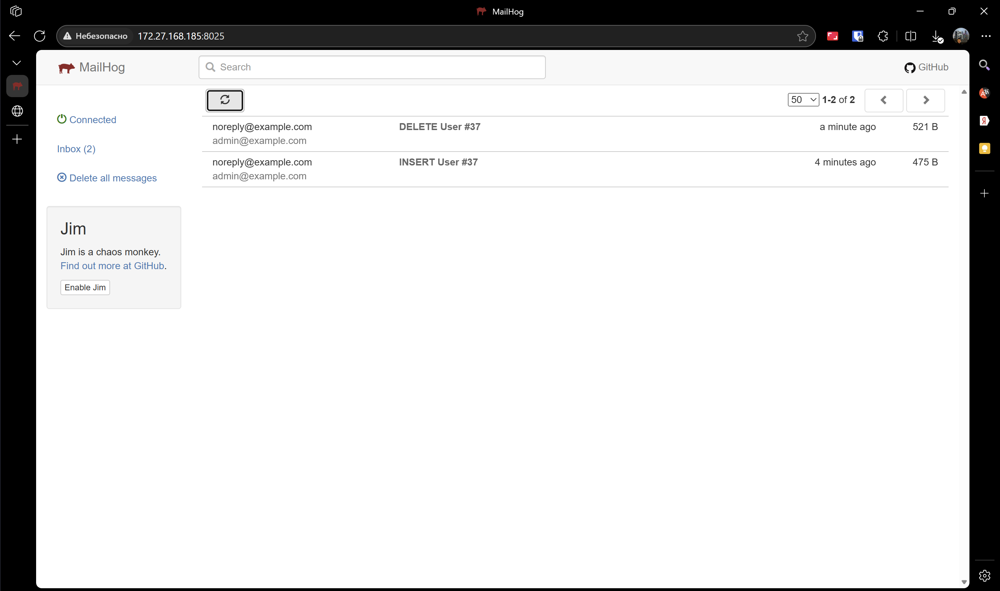

# Практическая работа №4
## Java Message Service
*Выполнили студенты группы 6132-010402D Сорокин Д.М. и Буторина П.В.*

### Задание 1
Добавили новую таблицу в базу данных, которая включает в id сущности, тип изменения, описание и временную метку

### Задание 2
Настроили Apache ActiveMQ JMS, конфигурация находится в файле `JmsConfig`.

### Задание 3
Реализовали класс  `ChangeEvent`, который формируется при изменении таблиц: создании, удалении 
Он отправляется в JMS-объект с помощью класса `ChangeEventPublisher`.

### Задание 4
Реализовали классы для прослушивания уведомлений и сохранения изменений в базу данных

### Задание 5
Уведомления отправляются только для `UserController` для операций `INSERT` и `DELETE`.

### Задание 6
Для наглядности добавили вывод лого на главную страницу.

Для более правильной работы программы было принято решение расширить контроллер и сервис пользователя для возможности добавления и удаления

В качестве демонстрационного варианта получения email-уведомлений подняли `mailhog` сервер внутри WSL

Пример письмем, которые приходят на почту:
